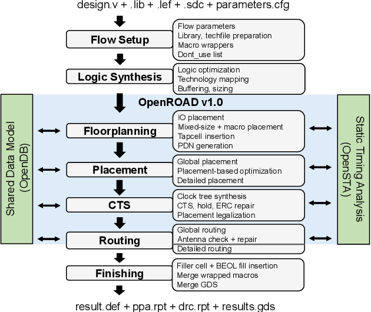
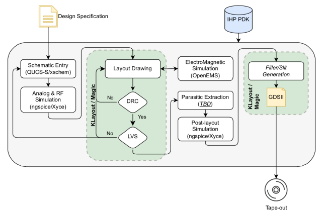

# BitChip

Open source design files of lowest nm ASIC for bitcoin mining that you can give for printing to the lab near you.

## Directory Structure

```
open-source-asic-bitcoin-chip-sha256/
├── doc/                      # Documentation files (design specs, datasheets, etc.)
│   ├── design-specs/          # High-level architecture and specifications
│   ├── user-manual/           # User manuals and guides
│   └── datasheets/            # Component datasheets and technical papers
│
├── src/                      # Source code files (Verilog RTL)
│   ├── core/                  # Core SHA-256 mining logic
│   │   ├── sha256_functions.v # Utility functions (Sigma, ROTR, etc.)
│   │   ├── sha256_round_stage.v # Round function for each pipeline stage
│   │   ├── sha256_pipeline.v # The 64-stage pipeline connecting rounds
│   │   ├── nonce_injector.v  # Inject nonce into the pipeline
│   │   ├── midstate_loader.v # Midstate calculation and reuse
│   │   └── bitcoin_sha256.v  # Full double-SHA256 computation
│   ├── verification/          # Verification files for functional tests
│   │   ├── testbenches/       # Testbenches for simulating design
│   │   └── coverage/          # Functional coverage reports
│   ├── tb/                    # Top-level testbench files
│   │   ├── tb_sha256.v        # Top-level testbench for SHA-256
│   │   └── tb_bitcoin.v       # Bitcoin miner-level testbench
│   └── scripts/               # Automation scripts for simulation and verification
│
├── synthesis/                 # Files for synthesis (DC or Yosys)
│   ├── scripts/               # Synthesis scripts (e.g., Tcl, Python)
│   ├── constraints/           # Constraints files (e.g., timing, placement)
│   ├── results/               # Results of synthesis (timing reports, power analysis)
│   └── libraries/             # Libraries (e.g., standard cell libraries)
│
├── pnr/                       # Placement and routing files
│   ├── scripts/               # PnR automation scripts (e.g., .tcl for ICC2, .xdc for Vivado)
│   ├── results/               # PnR results (layouts, routing reports)
│   ├── floorplans/            # Floorplan configurations (if applicable)
│   ├── constraints/           # Pin constraints, area constraints, etc.
│   └── techfiles/             # Technology files (e.g., LEF, DEF files for PnR tools)
│
├── place_route/               # Place-and-route outputs (e.g., netlists, GDS files)
│   ├── netlist/               # Gate-level netlists (post-synthesis)
│   ├── gds/                   # GDSII files (final chip layout)
│   ├── lef/                   # LEF files for PnR tools
│   ├── def/                   # DEF files (placement and routing)
│   └── reports/               # Reports (timing, power, area)
│
├── verification/              # Formal and simulation verification files
│   ├── uvm/                   # UVM-based verification (optional)
│   ├── coverage/              # Functional and code coverage
│   └── results/               # Simulation results (logs, waveform dumps)
│
├── tools/                     # External tools and utilities
│   ├── scripts/               # Custom automation scripts (e.g., build scripts, tools)
│   └── third_party/           # Third-party tools (e.g., synthesis tools, PnR tools)
│
└── build/                     # Build outputs (logs, temporary files, etc.)
    ├── logs/                  # Logs of the build process (timing, synthesis)
    ├── bin/                   # Compiled binaries (e.g., gate-level netlists)
    └── artifacts/             # Artifacts (synthesized netlists, bitstreams, etc.)
```
## Steps

1.  Reserve a shuttle.
2.  Design & verify with LibreLane/OpenROAD.   
3.  Run sign‑off (DRC/LVS/ERC/antenna) and follow pad/ESD guidelines.  
4.  Submit tape‑in bundle
5.  Fabrication in the pooled MPW.  
6.  Dicing & logistics.   
7.  Delivery of bare dies (and packaged parts)

! [ASIC dev flow](doc/images/pdkopen1EN.png) 






## Processes

https://github.com/google/gf180mcu-pdk

https://github.com/google/sky90fd-pdk

## Foundries

https://cyientsemi.com/asic-turnkey-solutions

https://precisioninno.com/

https://wafer.space

https://anysilicon.com/vendor_category/foundries/

### USA

https://www.skywatertechnology.com/manufacturing/facilities-capabilities/

Cyient Semiconductors Inc. 
Suite 260, One Bethany East, 
located at 900 W Bethany Dr, 
Allen, Texas 75013

### Canada

### Central America

### EU

https://www.slicesemiconductor.com/ (Ireland) 

https://www.chipflow.io/ (spain) 

Cyient Semiconductors GmbH
401, Dusseldorf Landstrabe, Duisburg, 47259, Germany

IHP GmbH - Leibniz Institute for High Performance Microelectronics
Im Technologiepark 25
15236 Frankfurt (Oder), Germany

Cyient Semiconductors NV
Researchpark Hassrode 1113 Esperantolaan 9, 3001 Heverlee, Leuven, Belgium

### UK

Cyient Semiconductors Europe Private Limited
Suite 1, First Floor Block A, Apex Plaza, Forbury Road, Reading, Berkshire, RG1 1AX, United Kingdom

### Russia

### China

### India

Cyient Semiconductors Private Limited (HQ)
2nd Floor, Plot No. 11 Software Unit Layout
Madhapur, Hyderabad
Telangana, India 500081

Cyient Ltd. Infotech IT Partk
Plot No - 110A & 110B,
Phase 1 Electronic City House Road,
Bengaluru, India 560 100

### LatAm

### Arab World

https://mabrains.com/

### Africa

### Oceania

## Upstream 

https://github.com/bitaxeorg

## References

https://github.com/skot/BM1397

[ASIC design for mining - David Vorrick](https://www.youtube.com/watch?v=BriKFe8qX1s)

https://github.com/progranism/Open-Source-FPGA-Bitcoin-Miner

Bitmain's Antminer use 7nm for older models like the S19 series 

S21 (5nm)  S23 (3nm), using foundries like TSMC for fabrication to achieve higher performance (hashrates) and lower power consumption (J/TH).

https://www.crowdsupply.com/wafer-space/gf180mcu-run-1
## Resources

https://www.crowdsupply.com/wafer-space/gf180mcu-run-1/updates/librelane-template

https://theopenroadproject.org/

https://www.zerotoasiccourse.com/

## Feedback

Liked this project? give feedback by messaging [securitybrahh](https://x.com/securitybrahh) on X.

If the project gets some traction, discord soon!

